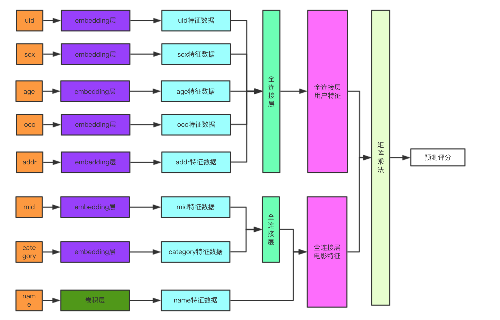
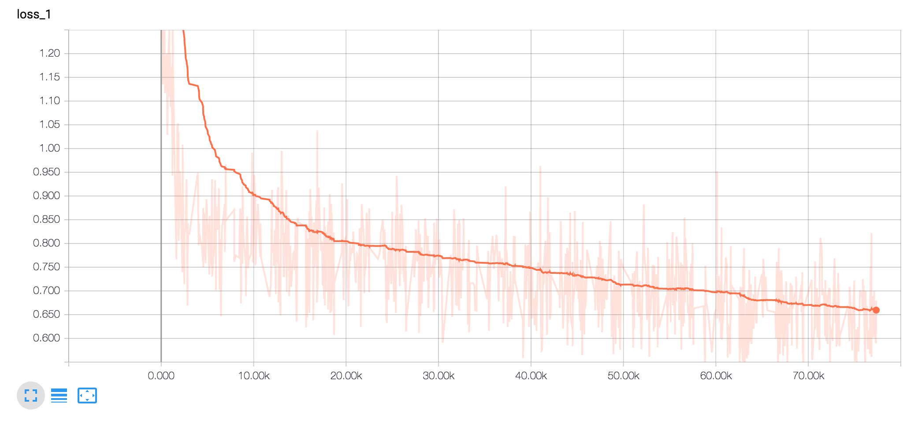

最近学习了下推荐系统，粗浅的了解一些知识，这里和大家分享一下，希望大家不吝赐教。


## 推荐算法介绍

推荐算法有以下几种场景：

-   基于内容/物品的推荐算法。
-   基于用户基本信息的推荐算法。
-   协同过滤推荐算法。

###基于内容/物品的推荐算法

简单来说，是推荐用户喜欢和自己关注过的item在内容上类似的item，比如你买了一件优衣库的衣服，基于内容的推荐算法会推荐优衣库的鞋子，是一种基础的推荐算法。

### 基于用户基本信息的推荐算法

这也是一种比较基础的推荐算法，基于用户的基本信息，给用户推荐他可能感兴趣的相关内容，比如用户是女性，给用户推荐衣服、化妆品之类的。

### 协同过滤推荐算法

协同过滤推荐算法也有两个维度，即基于用户的协议过滤推荐、基于物品的协同推荐。

-   基于用户的协议推荐

    以用户为基础，找到和你相识的用户之后，推荐他们看过而你没有看过的内容，比如你是一个geek，经常在天猫上买电子产品，有另外一些geek也经常在天猫上买电子产品，现在给你推荐他们买过的大疆无人机给你。

-   基于物品的协同推荐

    以物品为基础，通过物品建立相似度关系矩阵，比如你和小明同学都在天猫上购买了大疆的无人机和小米的平衡车，那么构建物品相似度关系矩阵，可以发现大疆无人机与小米平衡车有一定的关系，如果小红同学只购买了大疆的无人机，就可以把小米平衡车推荐给小红同学。

协同过滤推荐需要基于大量数据的训练，寻找不同场景下的某种未知联系，与基于内容/物品的推荐算法和基于用户基本信息的推荐算法不一样。


## 协同过滤推荐算法

以基于物品的协同过滤场景为例，首先构造出场景，构造出一个用户-物品的矩阵，描述用户购买物品的情况。

| 用户/物品 | 无人机 | 平衡车 | 短裙 | 眉笔 | 神仙水 |
| --------- | ------ | ------ | ---- | ---- | ------ |
| 小明      | √      | √      |      |      |        |
| 小白      |        | √      |      |      |        |
| 小红      |        |        | √    |      | √      |
| 小薇      |        |        |      | √    | √      |
| 你        |        |        |      | √    |        |

然后用数学模型描述上述矩阵：

用户矩阵是$P_{m}$，$m$是用户总数，物品矩阵是$\mathbf{Q}_{n}$，$n$是物品总数。

构造用户购买矩阵，$\mathbf{R}_{m \times n}$， $\mathbf{R}_{m \times n}$表示用户a购买物品b的情况($a  \le, b \le n$)。

现在目标是构建出一个推荐矩阵$ \mathbf{\hat R}_{m \times n}$，使得：$\mathbf{R}_{m \times n} \approx \mathbf{P}_{m \times k}  \times \mathbf{Q}_{k \times n} = \mathbf{\hat R}_{m \times n}$，其中k表示k个特征。

$ \mathbf{\hat R}_{m \times n}$矩阵类似：
| 用户/物品 | 无人机 | 平衡车 | 短裙 | 眉笔 | 神仙水 |
| --------- | ------ | ------ | ---- | ---- | ------ |
| 小明      | √      | √      |      |      |        |
| 小白      |        | √      |      |      |        |
| 小红      |        |        | √    |      | √      |
| 小薇      |        |        |      | √    | √      |
| 你        |        |        | 推荐 | √    | 推荐   |

构造出这个矩阵之后，遍历一下单个用户对各个物品的推荐情况，就可以得出推荐的物品了。


### 矩阵分解算法

现在有关系：$$\mathbf{R}_{m \times n} \approx \mathbf{P}_{m \times k}  \times \mathbf{Q}_{k \times n} = \mathbf{\hat R}_{m \times n}$$，目标是构建出$ \mathbf{\hat R}_{m \times n}$。

首先需要计算出$\mathbf{R}_{m \times n}$与$ \mathbf{\hat R}_{m \times n}$之间的距离，以均方差损失函数为例，可以得出：
$$
x^2_{i, j} = (r_{i, j} - \hat r_{i,j})^2 = (r_{i,j} - \sum_{k=1}^K p_{i,k}q_{k,j})^2
$$
其中$r_{i,j}$表示实际用户i购买j物品的情况，$\hat r_{i,j}$表示算法计算出来的用户i购买物品j的情况。

最终的目标是使得所有$r_{i,j}$不为null的项的损失之和最小，用数学公式表达就是：
$$
min\, loss = \sum_{r_{i,j}\ne null} e_{i,j}^2
$$

#### 损失函数计算

按照一般机器学习的方法，就是对损失函数求偏导，然后计算损失函数的梯度，使用梯度下降算法求解，那么公式来了：

-   首先对$p_{i,k}$求偏导：

    ​
    $$
    \frac{\partial}{\partial p_{i,k}}e_{i,j}^2 = -2(r_{i,j} - \sum_{k=1}^Kp_{i,k}q_{k,j})q_{k,j}=-2e_{i,j}q_{k,j}
    $$


-   然后对$q_{k,j}$求偏导：
    $$
    \frac{\partial}{\partial q_{k,j}}e_{i,j}^2 = -2(r_{i,j} - \sum_{k=1}^Kp_{i,k}q_{k,j})q_{i,k}=-2e_{i,j}q_{i,k}
    $$
    ​

然后按照常用的方法，就是构造一个微小的步长$\alpha$，每次迭代：
$$
p_{i,k}′ = p_{i,k} - \alpha \frac{\partial}{\partial p_{i,k}}e_{i,j}^2=p_{i,k}+ 2\alpha(e_{i,j}q_{k,j})
$$

$$
q_{i,k}′ = q_{k,j} - \alpha \frac{\partial}{\partial q_{k,j}}e_{i,j}^2=q_{k,j}+ 2\alpha(e_{i,j}p_{i,k})
$$

通过上面的式子循环更新$p_{i,k}$和$q_{i,k}$，直到算法收敛。

当然，为了使得算法能够有比较好的泛化能力，也可以增加正则项，比如增加L2正则损失函数，这就不在本文的讨论范围之内了。


### 个性化推荐

得到矩阵$P_{m \times k}$和$Q_{k \times k}$后，就可以进行各种预测了，例如：

-   预测用户i是否会购买物品j：

    直接计算$\sum_{k=1} p_{i,k} * q_{k,j}$即可得出用户i是否会购买物品j。

-   给用户推荐可能会喜欢的物品：

    将用户特征向量与物品特征向量矩阵做矩阵乘法，得出用户对所有物品的评分，然后取评分最高的top k个。

    公式为：
    $$
    \sum_{j=1}^{j\le n}\sum_{k=1}p_{i,k} \times q_{k,j}
    $$


-   购买了物品j的用户还喜欢购买哪些物品：
    -   首先选出喜欢购买某个物品的top k个用户，得到这k个用户的特征向量。
    -   然后计算这k个用户对所有物品的的评分，选择一些评分最高的物品最为推荐。


## 算法实现

### 数据集

本项目使用的是MovieLens 1M，包含6000个用户在近4000部电影上的1亿条评论。

数据集分为三个文件：用户数据users.dat，电影数据movies.dat和评分数据ratings.dat，可到[这里](https://grouplens.org/datasets/movielens/)下载，也可以下载更丰富维度数据进行测试，如MovieLens 10M数据集。

#### 用户数据

分别有用户ID、性别、年龄、职业ID和邮编等字段。

数据中的格式：uid::sex::age::occupation::zip-code（本文使用addr来表示）

-   sex，性别，取值F或者M。

-   age，年龄，如下：

    -   1: "不满18岁"
    -   18: "18-24"
    -   25: "25-34"
    -   35: "35-44"
    -   45: "45-49"
    -   50: "50-55"
    -   56: "56+"

-   occ，职业，取值如下:

    -   0: "other" or not specified
    -   1: "academic/educator"
    -   2: "artist"
    -   3: "clerical/admin"
    -   4: "college/grad student"
    -   5: "customer service"
    -   6: "doctor/health care"
    -   7: "executive/managerial"
    -   8: "farmer"
    -   9: "homemaker"
    -   10: "K-12 student"
    -   11: "lawyer"
    -   12: "programmer"
    -   13: "retired"
    -   14: "sales/marketing"
    -   15: "scientist"
    -   16: "self-employed"
    -   17: "technician/engineer"
    -   18: "tradesman/craftsman"
    -   19: "unemployed"
    -   20: "writer"

-   addr，实际上是邮政编码，本文中把它当做地址了。

#### 电影数据

分别有电影ID、电影名和电影风格等字段。

数据中的格式：mid::name::category。

-   name，电影名

-   category，类型，取值如下：
    -   Action
    -   Adventure
    -   Animation
    -   Children's
    -   Comedy
    -   Crime
    -   Documentary
    -   Drama
    -   Fantasy
    -   Film-Noir
    -   Horror
    -   Musical
    -   Mystery
    -   Romance
    -   Sci-Fi
    -   Thriller
    -   War
    -   Western


####评分数据

分别有用户ID、电影ID、评分和时间戳等字段。

数据中的格式：uid::mid::rating::timestamp，评分是5分制，时间戳暂时不适用。

理论说了这么多，来看具体的算法实现，这里采用机器学习框架[tensorflow](https://www.tensorflow.org/)来实现算法逻辑。


###网络结构

如下图：



用户数据使用了uid、sex、age、occ、addr这五个字段，每个字段都通过一个embedding层来获取特征。

电影数据使用了mid、category、name这三个字段，mid和category也通过一个embedding层来获取特征。但是name字段，通过一个卷积层来获取特征。

电影名使用卷积层的原因是，电影名也会有很多特征，比如《白夜追凶》，《孙悟空三打白骨精》之类的，通过电影名也能获取一些特征，使用多卷积层，收集不同的特征。

用户数据经过两个全连接层后，得出用户特征向量。电影数据经过全连接后，也得出了电影的特征向量。最终两个向量做矩阵乘法，可以预测用户的评分情况。


####神经网络结构

构建网络的代码如下：

```python
class Model(object):
    def __init__(self, enable_debug = True):
        self.enable_debug = enable_debug

    def initTensors(self):
        # user layers
        self.uid = tf.placeholder(tf.int32, [None, 1], name = "uid")
        self.sex = tf.placeholder(tf.int32, [None, 1], name = "sex")
        self.age = tf.placeholder(tf.int32, [None, 1], name = "age")
        self.occ = tf.placeholder(tf.int32, [None, 1], name = "occ")
        self.addr = tf.placeholder(tf.int32, [None, 1], name = "addr")

        # movie layer
        self.mid = tf.placeholder(tf.int32, [None, 1], name = "mid")
        # 电影最多有15个单词
        self.name = tf.placeholder(tf.int32, [None, 15], name = "name")
        # 电影类型最多有18个类型
        self.category = tf.placeholder(tf.int32, [None, 18], name = "category")

        # target
        self.target = tf.placeholder(tf.int32, [None, 1], name = "target")

        # learning rate
        self.learning_rate = tf.placeholder(tf.float32, name = "learning_rate")

        # keep dropout rate
        self.dropout_keep_prob = tf.placeholder(tf.float32, name = "dropout_keep_prop")

    def build_embedding_layer(self, input_layer, shape, name):
        with tf.name_scope(name + "_embedding"):
            matrix = tf.Variable(tf.random_uniform(shape, -1, 1), name = name + "embedding_matrix")
            embedding_layer = tf.nn.embedding_lookup(matrix, input_layer, name = name + "embedding_layer")
        return embedding_layer

    def buildUserLayers(self):
        with tf.name_scope("user_embedding_layer"):
            uid_embedding_layer = self.build_embedding_layer(self.uid, [UID_MAX, EMBEDDING_DIMENSION], name = "uid")
            sex_embedding_layer = self.build_embedding_layer(self.sex, [AGE_MAX, EMBEDDING_DIMENSION // 2], name = "sex")
            age_embedding_layer = self.build_embedding_layer(self.age, [AGE_MAX, EMBEDDING_DIMENSION // 2], name = "age")
            occ_embedding_layer = self.build_embedding_layer(self.occ, [OCC_MAX, EMBEDDING_DIMENSION // 2], name = "occ")
            addr_embedding_layer = self.build_embedding_layer(self.addr, [ADDR_MAX, EMBEDDING_DIMENSION], name = "addr")
            self.showTensors("user_layer", [uid_embedding_layer, sex_embedding_layer, age_embedding_layer, occ_embedding_layer, addr_embedding_layer])

        with tf.name_scope("user_fc"):
            # 各个embedding层的dense层
            uid_fc_layer = tf.layers.dense(uid_embedding_layer, EMBEDDING_DIMENSION, name = "uid_fc_layer", activation=tf.nn.relu)
            sex_fc_layer = tf.layers.dense(sex_embedding_layer, EMBEDDING_DIMENSION, name = "sex_fc_layer", activation=tf.nn.relu)
            age_fc_layer = tf.layers.dense(age_embedding_layer, EMBEDDING_DIMENSION, name = "age_fc_layer", activation=tf.nn.relu)
            occ_fc_layer = tf.layers.dense(occ_embedding_layer, EMBEDDING_DIMENSION, name = "occ_fc_layer", activation=tf.nn.relu)
            addr_fc_layer = tf.layers.dense(addr_embedding_layer, EMBEDDING_DIMENSION, name = "addr", activation=tf.nn.relu)
            self.showTensors("user_fc", [uid_fc_layer, sex_fc_layer, age_fc_layer, occ_fc_layer, addr_fc_layer])

            # 把各个dense层全连接起来

            # [None, 1, EMBEDDING_DIMENSION * 5]
            user_fc_layer = tf.concat([uid_fc_layer, sex_fc_layer, age_fc_layer, occ_fc_layer, addr_fc_layer], axis=2, name = "user_fc_layer_concat")
            user_fc_layer = tf.contrib.layers.fully_connected(user_fc_layer, USER_OUTPUT_DIMENSION, tf.nn.sigmoid)

            # reshape to [None, USER_OUTPUT_DIMENSION]
            user_fc_layer = tf.reshape(user_fc_layer, [-1, 1, USER_OUTPUT_DIMENSION], name = "user_fc_layer_reshape")

        return user_fc_layer

    def buildMovieLayers(self):
        with tf.name_scope("movie_name_embedding"):
            matrix = tf.Variable(tf.random_uniform([NAME_MAX, EMBEDDING_DIMENSION], -1, 1), name = "movie_name_embedding_matrix")
            movie_name_embedding_layer = tf.nn.embedding_lookup(matrix, self.name, name = "movie_name_embedding_layer")
            movie_name_embedding_layer = tf.expand_dims(movie_name_embedding_layer, -1)

        # 电影名的多卷积层
        conv_layer_list = []
        with tf.name_scope("movie_name_conv"):
            for kernel_size in range(2, 6):
                with tf.name_scope("movie_name_conv_%d" % kernel_size):
                    # [kernel_size, 32, 1, 8]
                    W = tf.Variable(tf.truncated_normal([kernel_size, EMBEDDING_DIMENSION, 1, NAME_CONV_KERNEL_COUNT], stddev=0.1), name = "movie_name_W")
                    B = tf.Variable(tf.constant(0.1, shape = [NAME_CONV_KERNEL_COUNT]), name = "movie_name_B")

                    # conv
                    conv_layer = tf.nn.conv2d(movie_name_embedding_layer, W, [1, 1, 1, 1], padding = "VALID", name = "movie_name_conv_layer")
                    conv_layer = tf.nn.bias_add(conv_layer, B, name = "movie_name_conv_layer_bias")
                    relu_layer = tf.nn.relu(conv_layer, name = "movie_name_relu_layer")

                    # pool
                    pool_layer = tf.nn.max_pool(relu_layer, [1, NAME_WORD_MAX - kernel_size + 1, 1, 1], [1, 1, 1, 1], padding = "VALID", name = "movie_name_pool_layer")
                    conv_layer_list.append(pool_layer)
        with tf.name_scope("movie_name_output"):
            conv_layer = tf.concat(conv_layer_list, 3, name = "movie_name_all_conv_layer")
            # 一共有4个卷积层，每个卷积层有NAME_CONV_KERNEL_COUNT个卷积核，输出共4 * NAME_CONV_KERNEL_COUNT
            conv_layer = tf.reshape(conv_layer, [-1, 1, 4 * NAME_CONV_KERNEL_COUNT])

        with tf.name_scope("movie_name_dropout_layer"):
            conv_layer = tf.nn.dropout(conv_layer, DROPOUT_KEEP_PROP)

        with tf.name_scope("movie_embedding_layer"):
            mid_embedding_layer = self.build_embedding_layer(self.mid, [MID_MAX, EMBEDDING_DIMENSION], name = "mid")
            category_mebdding_layer = self.build_embedding_layer(self.category, [CATEGORY_MAX, EMBEDDING_DIMENSION], name="category")
            category_mebdding_layer = tf.reduce_sum(category_mebdding_layer, axis = 1, keepdims = True)

        with tf.name_scope("movie_fc"):
            mid_fc_layer = tf.layers.dense(mid_embedding_layer, EMBEDDING_DIMENSION, name = "mid_fc_layer", activation = tf.nn.relu)
            category_fc_layer = tf.layers.dense(category_mebdding_layer, EMBEDDING_DIMENSION, name = "category_fc_layer", activation = tf.nn.relu)

            movie_layer = tf.concat([mid_fc_layer, category_fc_layer, conv_layer], 2)
            movie_layer = tf.contrib.layers.fully_connected(movie_layer, USER_OUTPUT_DIMENSION, tf.sigmoid)

            movie_layer = tf.reshape(movie_layer, [-1, 1, USER_OUTPUT_DIMENSION], name = "movie_fc_layer_reshape")
        return movie_layer

    def inference(self, graph):
        self.initTensors()
        user_layer = self.buildUserLayers()
        movie_layer = self.buildMovieLayers()
        with tf.name_scope("inference"):
            # 用户特征矩阵与电影特征矩阵做乘法
            inference = tf.matmul(user_layer, tf.matrix_transpose(movie_layer))
            # 预测评分
            inference = tf.reshape(inference, [-1, 1], name = "inference")
        with tf.name_scope("loss"):
            cost = tf.losses.mean_squared_error(self.target, inference)
            loss = tf.reduce_sum(cost, name = "loss")

        global_step = tf.Variable(0, name = "global_step", trainable = False)
        optimizer = tf.train.AdamOptimizer(self.learning_rate)
        gradients = optimizer.compute_gradients(loss)
        train_op = optimizer.apply_gradients(gradients, global_step = global_step)

        return train_op, inference, loss, gradients, global_step

```

代码中并不是两个矩阵做分解，而是利用神经网络的特点，计算出用户特征向量与电影特征向量，然后特征向量做矩阵乘法，得出$\mathbf{\hat R}_{m \times n}$，使用MSE计算误差，用Adam优化误差，最终收敛。


###训练

训练代码如下：

```python
class Trainer(object):
    def __init__(self, epoch, batch_size):
        self.epoch = epoch
        self.batch_size = batch_size

    def get_batches(self, X, Y, batch_size):
        for start in range(0, len(X), batch_size):
            end = min(start + batch_size, len(X))
            yield X[start:end], Y[start:end]

    def train(self, model):
        if os.path.exists(SAVE_DIR):
            shutil.rmtree(SAVE_DIR)
        os.mkdir(SAVE_DIR)
        inputer = DataInpter("./ml-1m")
        features, targets_values = inputer.readData()
        losses = { "train": [], "test": [] }
        with tf.Session() as sess:
            train_op, inference, loss, gradients, global_step = model.inference(sess.graph)
            uid, sex, age, occ, addr, mid, category, name, target, inference, user_layer, movie_layer, learning_rate, dropout_keep_prob = model.getTensors(sess.graph)
            out_dir = os.path.abspath(os.path.join(os.path.curdir, "train"))
            if os.path.exists(out_dir):
                shutil.rmtree(out_dir)
                os.mkdir(out_dir)
            print "please watch tensorboard at logdir %s" % out_dir

            with tf.name_scope("accuracy"):
                correct_rate = tf.equal(tf.cast(tf.round(inference), tf.int32), target)
                accuracy = tf.reduce_mean(tf.cast(correct_rate, tf.float32))
                accuracy_summary = tf.summary.scalar("accuracy", accuracy)

            loss_summary = tf.summary.scalar("loss", loss)
            train_summary_op = tf.summary.merge([loss_summary, accuracy_summary])

            train_summary_writer = tf.summary.FileWriter(os.path.join(out_dir, "summaries", "train"), sess.graph)
            test_summary_writer = tf.summary.FileWriter(os.path.join(out_dir, "summaries", "test"), sess.graph)

            # begin to train
            sess.run(tf.global_variables_initializer())
            saver = tf.train.Saver()
            for epoch_i in range(self.epoch):
                trainX, testX, trainY, testY = train_test_split(features, targets_values, test_size = 0.2, random_state = 0)
                train_batches = self.get_batches(trainX, trainY, self.batch_size)
                test_batches = self.get_batches(testX, testY, self.batch_size)

                for batch_i in range(len(trainX) // self.batch_size):
                    x, y = next(train_batches)
                    names = np.zeros([self.batch_size, NAME_WORD_MAX])
                    for i in range(self.batch_size):
                        names[i] = x.take(6, 1)[i]
                    categories = np.zeros([self.batch_size, 18])
                    for i in range(self.batch_size):
                        categories[i] = x.take(7, 1)[i]

                    feed_dict = {
                        uid: np.reshape(x.take(0, 1), [self.batch_size, 1]),
                        sex: np.reshape(x.take(2, 1), [self.batch_size, 1]),
                        age: np.reshape(x.take(3, 1), [self.batch_size, 1]),
                        occ: np.reshape(x.take(4, 1), [self.batch_size, 1]),
                        addr: np.reshape(x.take(5, 1), [self.batch_size, 1]),
                        mid: np.reshape(x.take(1, 1), [self.batch_size, 1]),
                        category: categories,
                        name: names,
                        target: np.reshape(y, [self.batch_size, 1]),
                        dropout_keep_prob: DROPOUT_KEEP_PROP,
                        learning_rate: LEARNING_RATE
                    }
                    step, train_loss, summaries, predicts = sess.run([global_step, loss, train_summary_op, train_op], feed_dict = feed_dict)
                    losses['train'].append(train_loss)
                    train_summary_writer.add_summary(summaries, step)

                    if (epoch_i * (len(trainX) // self.batch_size) + batch_i) % 50 == 0:
                        time_str = datetime.datetime.now().isoformat()
                        print('{}: train epoch {:>3} batch {:>4}/{}   train_loss = {:.3f}'.format( time_str, epoch_i, batch_i, (len(trainX) // self.batch_size), train_loss))
                for batch_i in range(len(testX) // self.batch_size):
                    x, y = next(test_batches)
                    names = np.zeros([self.batch_size, NAME_WORD_MAX])
                    for i in range(self.batch_size):
                        names[i] = x.take(6, 1)[i]
                    categories = np.zeros([self.batch_size, 18])
                    for i in range(self.batch_size):
                        categories[i] = x.take(7, 1)[i]

                    feed_dict = {
                        uid: np.reshape(x.take(0, 1), [self.batch_size, 1]),
                        sex: np.reshape(x.take(2, 1), [self.batch_size, 1]),
                        age: np.reshape(x.take(3, 1), [self.batch_size, 1]),
                        occ: np.reshape(x.take(4, 1), [self.batch_size, 1]),
                        addr: np.reshape(x.take(5, 1), [self.batch_size, 1]),
                        mid: np.reshape(x.take(1, 1), [self.batch_size, 1]),
                        category: categories,
                        name: names,
                        target: np.reshape(y, [self.batch_size, 1]),
                        dropout_keep_prob: 1,
                        learning_rate: LEARNING_RATE
                    }
                    step, test_loss, summaries, _ = sess.run([global_step, loss, train_summary_op, train_op], feed_dict = feed_dict)
                    losses['test'].append(test_loss)
                    test_summary_writer.add_summary(summaries, step)

                    time_str = datetime.datetime.now().isoformat()
                    if (epoch_i * (len(testX) // self.batch_size) + batch_i) % 50 == 0:
                        print('{}: test epoch {:>3} batch {:>4}/{}   test_loss = {:.3f}'.format(time_str, epoch_i, batch_i, (len(testX) // self.batch_size), test_loss))

                if epoch_i % 5 == 4:
                    saver.save(sess, os.path.join(SAVE_DIR, "saver") + "_%d" % epoch_i)
```


通过tensorboard观察，损失如下：



由于个人电脑计算能力有限，只算到了epoch=20，从趋势来看，loss值还在下降，还有继续训练的必要。


### 预测

#### 用户特征向量与电影特征向量的获取

获取特征向量的方法也特别简单，把一个用户输入会获得一个用户的特征向量，一个电影输入会获得一个电影的特征向量，把所有的用户输入到神经网络中，会说的所有用户的特征向量，同理输入所有电影会获得所有电影的特征向量。

代码如下：

```python
def genreateMovieMatrix(self, movies_values):
    movie_matrics = []
    graph = tf.Graph()
    with tf.Session(graph=graph) as sess:
    self.loadGraphFromFile(sess, self.model_path)
    uid, sex, age, occ, addr, mid, category, name, target, inference, user_layer, movie_layer, lr, dropout_keep_prob = self.model.getTensors(graph)

    for movie_info in movies_values:
        categories = np.zeros([1, 18])
        categories[0] = movie_info.take(2)

        names = np.zeros([1, NAME_WORD_MAX])
        names[0] = movie_info.take(1)

        feed = {
            mid: np.reshape(movie_info.take(0), [1, 1]),
            category: categories,
            name: names,
            dropout_keep_prob: 1,
        }

        movie_fc_layer = sess.run([movie_layer], feed_dict = feed)
        movie_matrics.append(movie_fc_layer)
    movie_matrics = np.reshape(movie_matrics, [-1, USER_OUTPUT_DIMENSION])
    return movie_matrics


def generateUserMatrix(self, users_values):
    user_matrics = []
    graph = tf.Graph()
    with tf.Session(graph=graph) as sess:
        self.loadGraphFromFile(sess, self.model_path)
        uid, sex, age, occ, addr, mid, category, name, target, inference, user_layer, movie_layer, lr, dropout_keep_prob = self.model.getTensors(graph)

        for user_info in users_values:
            feed = {
                uid: np.reshape(user_info.take(0), [1, 1]),
                sex: np.reshape(user_info.take(1), [1, 1]),
                age: np.reshape(user_info.take(2), [1, 1]),
                occ: np.reshape(user_info.take(3), [1, 1]),
                addr: np.reshape(user_info.take(4), [1, 1]),
                dropout_keep_prob: 1,
            }

            user_fc_layer = sess.run([user_layer], feed)
            user_matrics.append(user_fc_layer)
    user_matrics = np.reshape(user_matrics, [-1, USER_OUTPUT_DIMENSION])
    return user_matrics
```


#### 找相似的电影

找相似的电影的方法在算法介绍部分也有介绍，就是计算这部电影与所有电影的向量夹角，找到夹角最小的top k部电影，推荐出来，有点kmeans聚类算法的意思。

算法实现如下：

```python
def recommendMovieByMovie(self, movie_matrics, mid, inputer, count):
    #根据mid获取电影的index
    mid_index = inputer.transferMIDToIndex(mid)
    # 做一个类似Normalization的操作，把电影特征值分布到合理范围内
    norm_movie_matrics = np.sqrt(np.add.reduce(np.square(movie_matrics)))
    normalized_movie_matrics = np.divide(movie_matrics, norm_movie_matrics)

    # 推荐相似的电影
    probs_embeddings = (movie_matrics[mid_index]).reshape([1, USER_OUTPUT_DIMENSION])
    # 当前电影特征与所有电影特征做矩阵乘法
    probs_similarity = np.dot(probs_embeddings, normalized_movie_matrics.T)

    current_movie = inputer.getRawMoviesValues()[mid_index]
    print("您看的电影是：{}, 类型是：{}".format(current_movie[1], current_movie[2]))
    print("以下是相似的电影：")
    p = np.squeeze(probs_similarity)
    p[np.argsort(p)[:-count]] = 0
    p = p / np.sum(p)
    results = set()
    while len(results) != 10:
        c = np.random.choice(3883, 1, p=p)[0]
        results.add(c)
    for val in (results):
        recommend_movie = inputer.getRawMoviesValues()[val]
        print("电影是：{}, 类型是：{}".format(recommend_movie[1], recommend_movie[2]))

    return results
```

运行结果如下：

```
您看的电影是：Glass Shield, The (1994), 类型是：Crime|Drama
以下是相似的电影：
电影是：Hunt for Red October, The (1990), 类型是：Action|Thriller
电影是：Patriot, The (2000), 类型是：Action|Drama|War
电影是：Bridge at Remagen, The (1969), 类型是：Action|War
电影是：Erin Brockovich (2000), 类型是：Drama
电影是：True Crime (1995), 类型是：Mystery|Thriller
电影是：Firelight (1997), 类型是：Drama
电影是：Song of Freedom (1936), 类型是：Drama
电影是：Return to Me (2000), 类型是：Drama|Romance
电影是：Perfect Blue (1997), 类型是：Animation|Mystery
电影是：Just Cause (1995), 类型是：Mystery|Thriller
```


#### 猜你喜欢的电影

猜你喜欢的电影的计算方法前面也提到过，就是用户的特征向量与所有电影的特征向量做矩阵乘法，获得的是用户对所有电影的评分，然后挑选出评分最好的top k个即可。

代码如下：

```python
def recommendMovieByUser(self, user_matrics, movie_matrics, uid, inputer, count):
    uid_index = uid - 1
    #猜你喜欢的电影
    probs_embeddings = (user_matrics[uid_index]).reshape([1, USER_OUTPUT_DIMENSION])
    probs_similarity = np.dot(probs_embeddings, movie_matrics.T)
    print("以下是给您的推荐：")
    p = np.squeeze(probs_similarity)
    p[np.argsort(p)[:-count]] = 0
    p = p / np.sum(p)
    results = set()
    while len(results) != 10:
        c = np.random.choice(3883, 1, p=p)[0]
        results.add(c)
    for val in (results):
        recommend_movie = inputer.getRawMoviesValues()[val]
        print("推荐的电影是：{}, 类型是：{}".format(
            recommend_movie[1], recommend_movie[2]))

    return results
```


运行结果如下：

```
以下是给您的推荐：
电影是：My Life as a Dog (Mitt liv som hund) (1985), 类型是：Drama
电影是：Star Wars: Episode IV - A New Hope (1977), 类型是：Action|Adventure|Fantasy|Sci-Fi
电影是：Fistful of Dollars, A (1964), 类型是：Action|Western
电影是：Butch Cassidy and the Sundance Kid (1969), 类型是：Action|Comedy|Western
电影是：Star Trek: The Wrath of Khan (1982), 类型是：Action|Adventure|Sci-Fi
电影是：Sanjuro (1962), 类型是：Action|Adventure
电影是：Wings of Desire (Der Himmel �ber Berlin) (1987), 类型是：Comedy|Drama|Romance
电影是：Dorado, El (1967), 类型是：Western
电影是：Great Escape, The (1963), 类型是：Adventure|War
电影是：Seven Samurai (The Magnificent Seven) (Shichinin no samurai) (1954), 类型是：Action|Drama
```


#### 其他推荐

当然还可以做很多推荐，比如看了《白夜最凶》的人，还喜欢看某某某电影。同地区的人都喜欢看什么？同年轻的人都喜欢看什么？原理都类似，这里就不展开赘述了。


## 总结：

作为一个小菜，参考了很多资料，才总结出来这样一篇，文章中还有很多不对的地方，希望大家批评指正。

完整代码目录在[github](https://github.com/sjjwind0/movie_recommend)上。